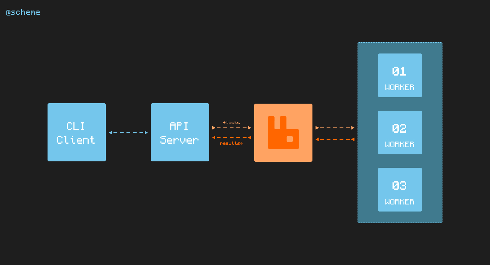

# taskify (HEAVILY WIP)

Task's queue system design, implemented with Golang and RabbitMQ

## Todo

- [X] Replace scheme's Kafka with RabbitMQ
- [X] Implement simple N Workers
- [X] Connect workers to RabbitMQ
- [X] Create API for task submission
- [X] Develop CLI app for multiple API calls
- [ ] Show more information about task's result
- [ ] Create shared config file to config synchronization
- [ ] Fill root's readme and all submodules
