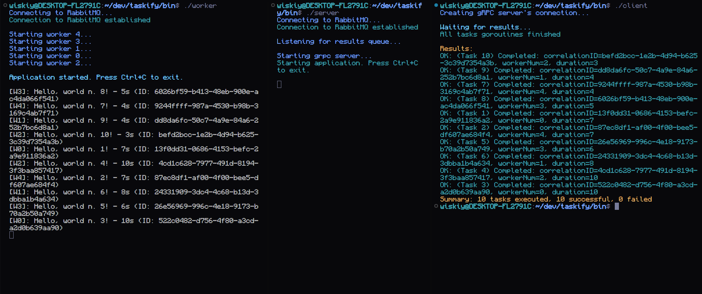

# taskify (WIP)

Taskify is a project implementing a distributed task processing system using Go and RabbitMQ. It showcases pattern where a client submits tasks synchronously via an API, but the tasks are processed asynchronously by a pool of workers using a message queue.

## Overview

1. **CLI Client** submits tasks via gRPC.
2. **API Server** receives tasks and forwards them to the `tasks` queue.
3. **Workers** consume from `tasks`, execute jobs, then publish results to the `results` queue.
3. **API Server** receives results from the `results` queue and sends them back to the client.

## Getting Started

1. Clone the repository.
2. Run `make build` to build the binaries.
3. Ensure you have RabbitMQ installed and running on your local machine or on a remote server.
4. Cd int `bin` and run `worker` and `server` binaries.
5. Run `client` binary with options needed (use `./client --help` to get started).

